# Jangplen: AI Music Library & Generation Platform

This is a modern, full-stack application for managing music libraries and generating AI-powered songs. It features a decoupled architecture with a **Django REST Framework** backend and a **Next.js** frontend.

The platform provides comprehensive CRUD operations for **Libraries** and **Songs**, integrated AI generation via Suno AI, and a robust authentication system.

## Local Setup

### Prerequisites
- Python 3.8 or higher
- pip (Python package installer)

### Installation Steps

You must create .env file from .env.example

1. **Clone the repository** (if not already done):
   ```bash
   git clone https://github.com/ScUth/Jangplen.git
   cd jangplen
   ```

2. **Navigate to the Django project**:
   ```bash
   cd django
   ```

3. **Create a virtual environment**:
   ```bash
   python -m venv .venv
   ```

4. **Activate the virtual environment**:
   - On Linux/Mac:
     ```bash
     source .venv/bin/activate
     ```
   - On Windows:
     ```bash
     .venv\Scripts\activate
     ```

5. **Install dependencies**:
   ```bash
   pip install -r requirements.txt
   ```

6. **Run database migrations**:
   ```bash
   python manage.py migrate
   ```

7. **Start the development server**:
   ```bash
   python manage.py runserver
   ```

8. **Access the application**:
   Open your browser and go to `http://localhost:8000/libraries/` to see the application in action.

### Additional Notes
- The project uses SQLite as the default database, so no additional database setup is required.
- Media files (uploaded songs) are stored in the `media/songs/` directory.
- For production deployment, make sure to configure proper settings in `core/settings.py`.

## Next.js Frontend Setup (Optional)

If you also want to run the Next.js frontend:

1. **Navigate to the Next.js project**:
   ```bash
   cd ../nextjs
   ```

2. **Install dependencies**:
   ```bash
   npm install
   ```

3. **Start the development server**:
   ```bash
   npm run dev
   ```

4. **Access the frontend**:
   Open your browser and go to `http://localhost:3000`.

## Features & CRUD Evidence

The project is built as a RESTful API, powering a dynamic Next.js frontend. Below are the primary endpoints and features:

### 1. Authentication
- **Register:** `POST /api/auth/register/` - Create a new user account.
- **Login:** `POST /api/auth/login/` - Authenticate and receive a token.
- **Google Login:** `POST /api/auth/google/` - OAuth2 integration for social login.
- **User Profile:** `GET /api/auth/user/` - Fetch authenticated user details.

### 2. Libraries (Collections)
- **List Mine:** `GET /api/libraries/mine/` - Retrieve libraries owned by the current user.
- **Create:** `POST /api/libraries/` - Create a new music collection.
- **Read:** `GET /api/libraries/<id>/` - View specific library details and nested songs.
- **Update:** `PUT/PATCH /api/libraries/<id>/` - Modify library metadata.
- **Delete:** `DELETE /api/libraries/<id>/` - Remove a library and its associations.

### 3. Songs & AI Generation
- **AI Generation:** `POST /api/suno/generate/` - Trigger AI song generation (Prompt-to-Song).
- **Status Polling:** `GET /api/suno/status/<task_id>/` - Monitor generation progress.
- **Save to Library:** `POST /api/suno/save/` - Persist generated songs into a user library.
- **Traditional CRUD:** `GET /api/songs/`, `POST /api/songs/`, `DELETE /api/songs/<id>/` - Standard management of song records.
- **Lyrics Generation:** `POST /api/suno/lyrics/generate/` - Generate AI lyrics based on a prompt.

### 4. Content Moderation
- Integrated **Moderation Service** ensures that generated prompts and lyrics adhere to safety guidelines before processing.

## Running the Project

To start the server, make sure your virtual environment is active (if you have one), install the necessary requirements, then run:

```bash
python manage.py runserver
```
### How to run Mock-mode
1. Open the website via `http://localhost:3000`

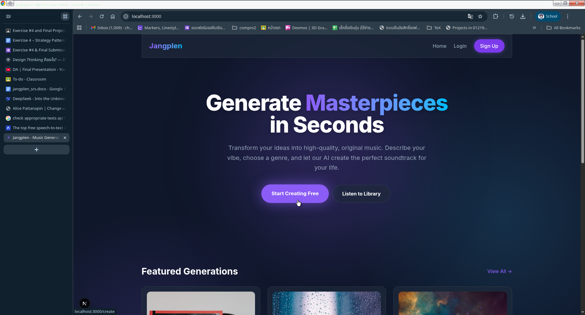

2. Click Login if you have an account or click Sign Up if you doesn't

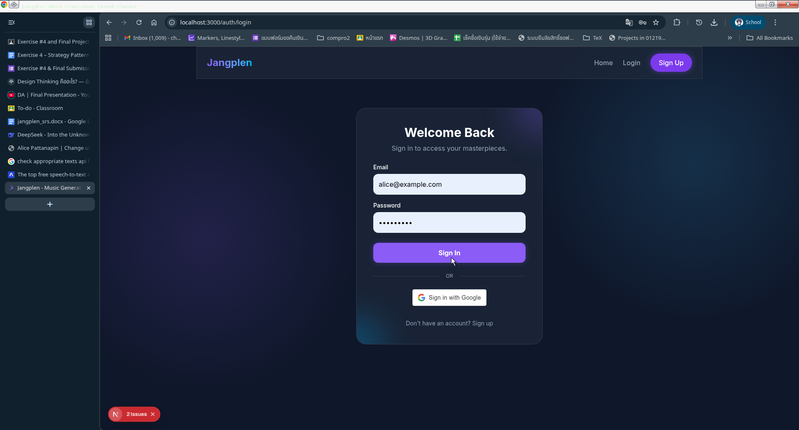

3. After logged in click *Start Creating Free*


4. From *Create New Song* Page click *Mock Mode* on the right hand side of the screen just like on the given picture below

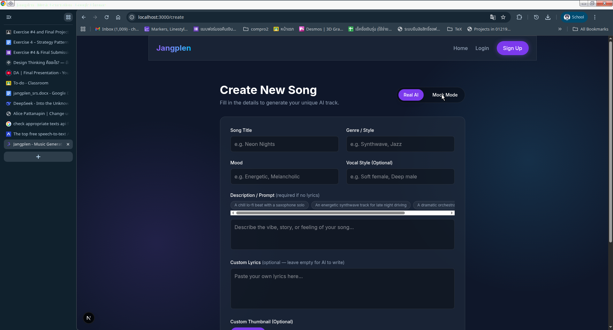

5. Write the song generation information that you want to generate in to the field and then click *Generate Song*

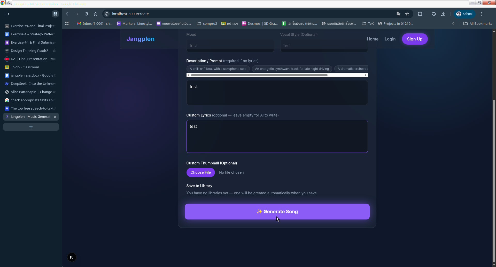

6. After generating the song wait until finish. You can see the progress on the progress bar below.

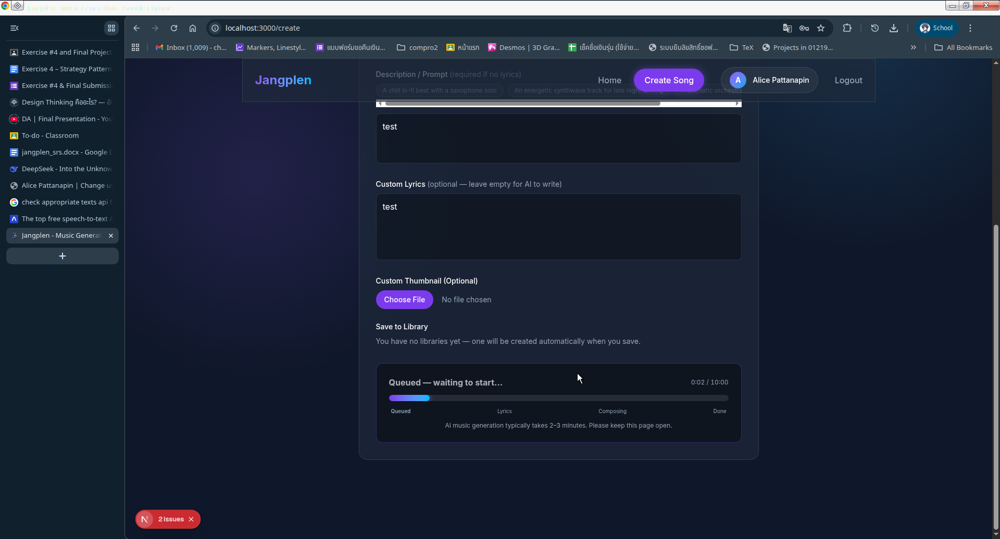

7. After finished, the song card will pop-up on to the screen and you can feel free to play that song *credit 狙えホームラン by Satoru Kōsaki*

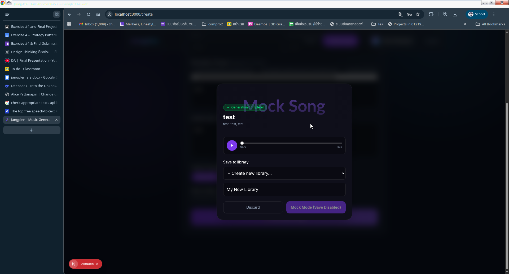

### How to run Suno-mode

1. Open the website via `http://localhost:3000`


2. Click Login if you have an account or click Sign Up if you doesn't


3. After logged in click *Start Creating Free*


4. Write the song generation information that you want to generate in to the field and then click *Generate Song*

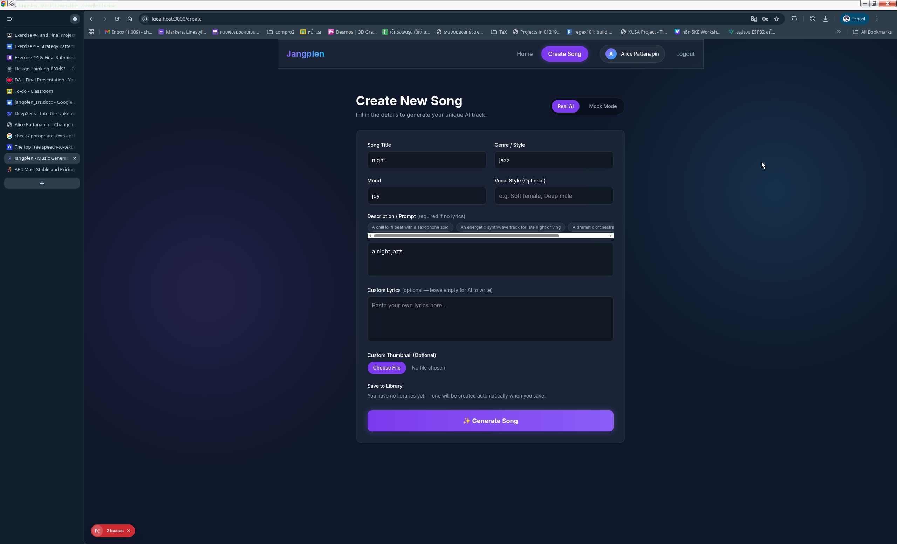

5. After generating the song wait until finish. You can see the progress on the progress bar below.

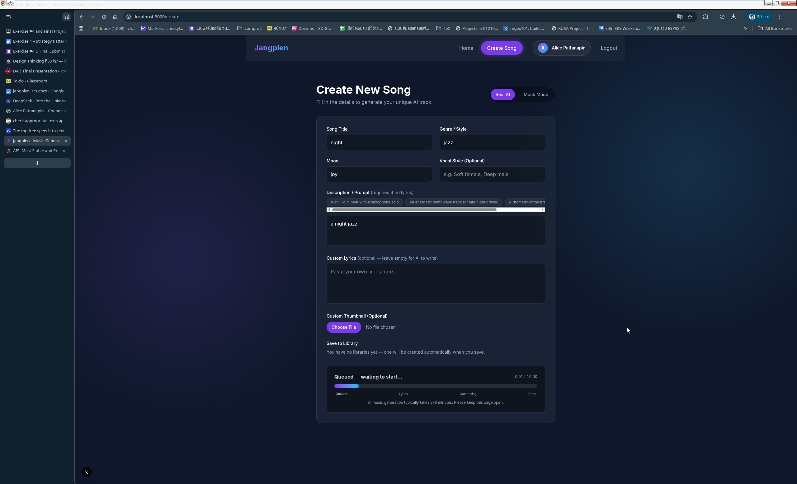

7. After finished, the song card will pop-up on to the screen and you can feel free to play that song. And you'll choose the only song you like and save at the library you want by selecting from the card and save it by click *Save to Library*

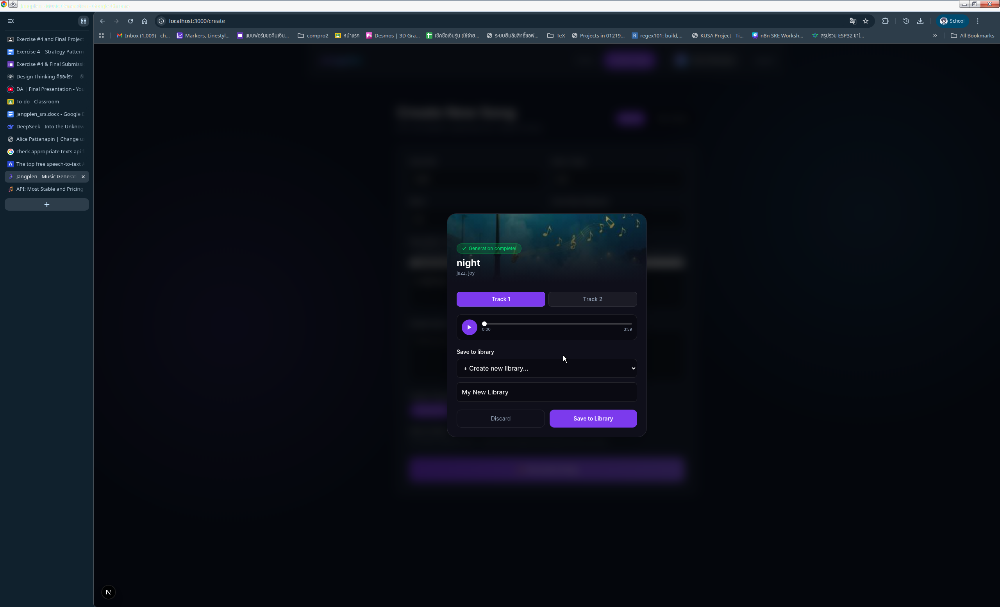

## Where to put the API key
You can edited the API key on the `/jangplen/django/.env` and `/jangplen/nextjs/.env.local` or if you doesn't have `.env` file from that direction you can use this command

For `.env`
```bash
cp .env.example .env # Unix or powershell
# or
copy .env.example .env # cmd (Windows)
```
For `.env.local`
```bash
cp .env.example .env.local # Unix or powershell
# or
copy .env.example .env.local # cmd (Windows)
```

then you must put your `SUNO_API_KEY` and `OPENAI_API_KEY` and `GOOGLE_CLIENT_ID` on the `.env` file.

## Minimal demonstration
- mock generation works

On above, yes.

- Suno generation creates a taskId and can retrieve status/details

On above, yes.

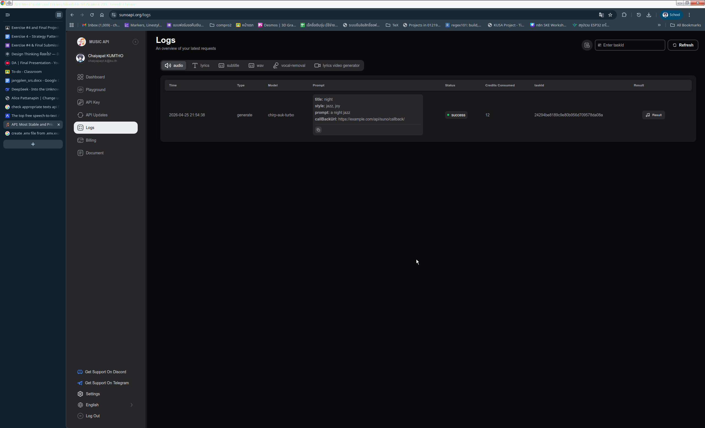

## Architecture & Design Patterns

This project implements several design patterns to ensure flexibility and maintainability. A key pattern used is the **Strategy Pattern** for the song and lyrics generation pipeline, allowing seamless toggling between a live Suno AI service and a local mock service.

### Class Diagram

The following diagram illustrates the Strategy Pattern implemented in the Django backend:

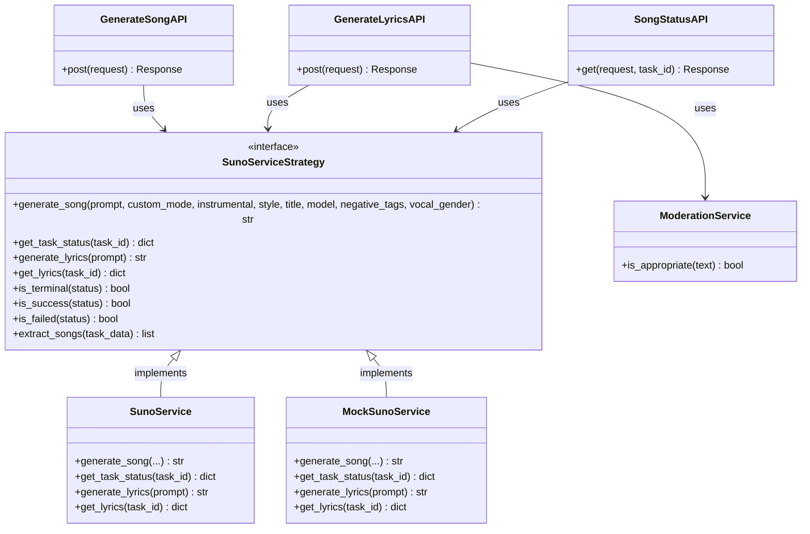

### Sequence Diagram

The following sequence diagram outlines the process of generating a song and saving it to a library, demonstrating how the frontend interacts with the Django API which delegates to the active strategy.

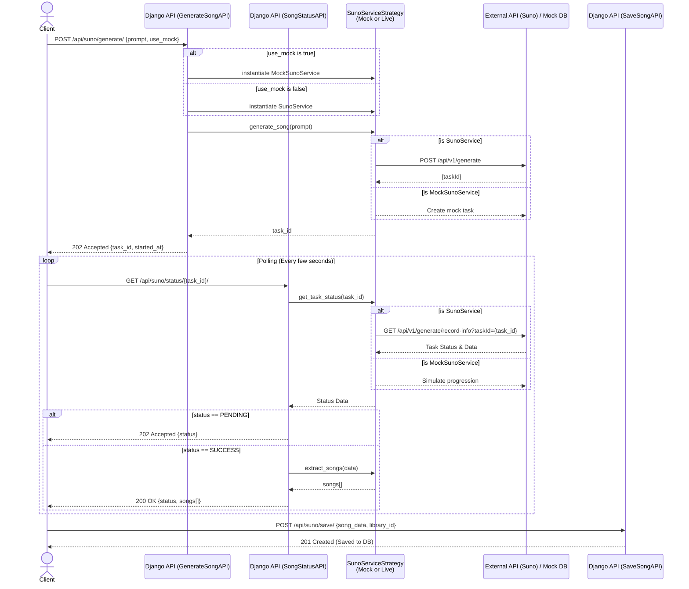
